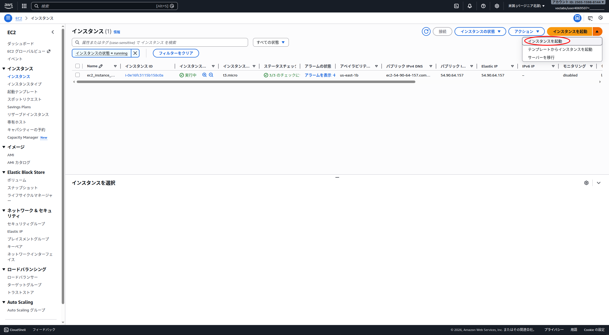
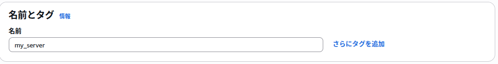
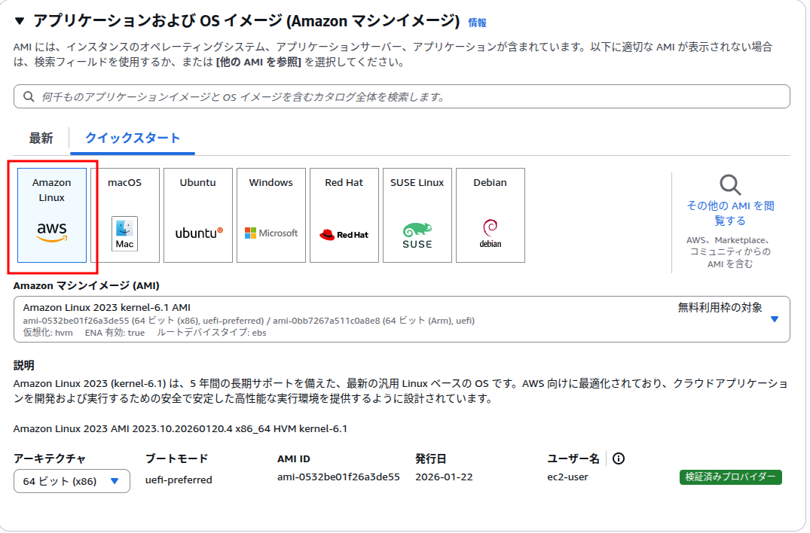
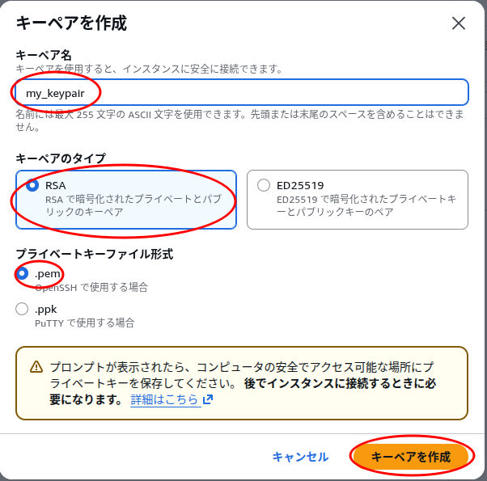
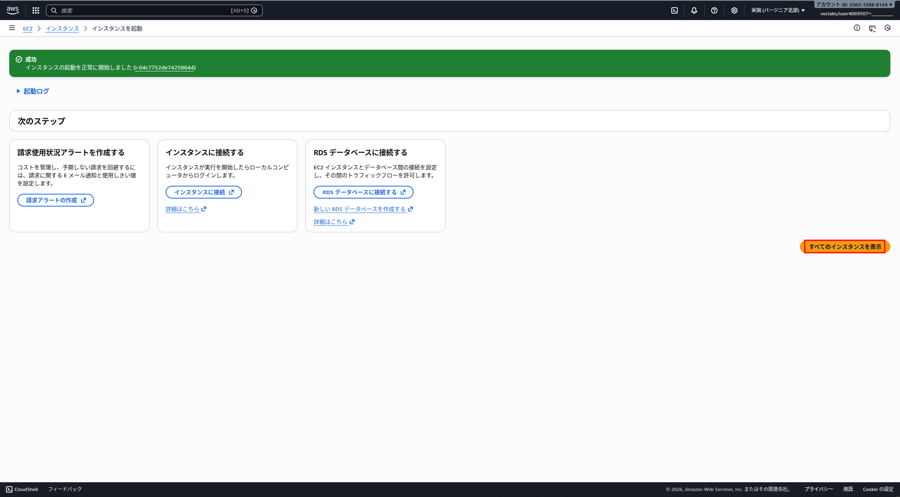

# AWS EC2 & サービス構築手順書

本ドキュメントは、AWS EC2インスタンスの新規作成から、Git/Dockerのセットアップ、アプリケーションの起動までの手順を記したものです。

## 1. AWS EC2インスタンスの作成

### 1.1 インスタンスの作成

1. AWSのダッシュボードで「EC2」と検索し、**EC2サービス**をクリックしてください。


2. EC2ダッシュボードへ移動したら、**インスタンス**をクリックしてください。


3. インスタンスリストへ移動したら、**インスタンスの起動**をクリックしてください


4. インスタンス作成画面へ移動したら、EC2インスタンスの名前を入力してください。


5. OSイメージは**AmazonLinux**を選択してください


6. インスタンスタイプは**t3.micro**にします。


7. 初期段階ではキーペアが存在しないので、**新しいキーペアの作成**をクリックします。


8. キーペア名を入力し、RSA、.pemが選択できたら、**キーペアを作成**をクリックします。<br>
ここでダウンロードされたpemファイルは保管してください。


9. 作成したキーペアを選択してください。


10. セキュリティグループを作成を選択し、SSH,HTTP,HTTPS全てのトラフィックを許可した後、<br>
自分のIPを選択して下さい


11. ストレージや高度な詳細は設定しなくて大丈夫です。<br>
すべての設定が終わったら**インスタンスを起動**をクリックします。


12. インスタンスの作成が終わったら、**すべてのインスタンスを表示**をクリックします。


### 1.2 インスタンスへの接続

1. sshコマンドに必要なので、パブリックipv4をコピーします。<br>
（画面下部に出てきたインスタンス詳細にコピーボタンがあります。）


2. コマンドプロンプトを起動し、下記コマンドを実行します。<br>
```bash
ssh -i <pemファイルのパス> ec2-user@<パブリックipv4>
```

linuxの場合、pemファイルの権限によってはエラーが出るので、<br>
その場合は下記コマンドを実行してから再度ssh接続を試みてください。
```bash
chmod 600 <pemファイルのパス>
```

3. `Are you sure you want to continue connectin`と聞かれるので、<br>
yesと入力してください。

4. よくわからん鳥が出てきたら接続完了です。
```bash
   ,     #_
   ~\_  ####_        Amazon Linux 2023
  ~~  \_#####\
  ~~     \###|
  ~~       \#/ ___   https://aws.amazon.com/linux/amazon-linux-2023
   ~~       V~' '->
    ~~~         /
      ~~._.   _/
         _/ _/
       _/m/'
```

## 2. Git/Dockerでの環境構築

### 2.1 このリポジトリをクローンする

1. Gitをインストール
```bash
sudo yum install git -y
```

2. リポジトリをクローンする
```bash
git clone https://github.com/Stone5656/php_bbs_sns_kouki_kadai.git
```

### 2.2 サービスを起動する

1. Dockerをインストールする
```bash
sudo yum install -y docker
sudo systemctl start docker
sudo systemctl enable docker
```

2. ユーザーをdockerグループに追加
```bash
sudo usermod -a -G docker ec2-user
```
sshの再接続が必要なので、一度ログアウトしてください
```bash
exit
```

3. Docker Composeをインストールする
```bash
sudo mkdir -p /usr/local/lib/docker/cli-plugins/
sudo curl -SL https://github.com/docker/compose/releases/download/v2.36.0/docker-compose-linux-x86_64 -o /usr/local/lib/docker/cli-plugins/docker-compose
sudo chmod +x /usr/local/lib/docker/cli-plugins/docker-compose
```

4. ルートフォルダに移動
```bash
cd php_bbs_sns_kouki_kadai/
```

5. サービスを起動する
```bash
docker compose up
```
起動したらログが大量に出ます。<br>
ログが止まったらhttp://<パブリックipv4>/login.phpにアクセスしてください

